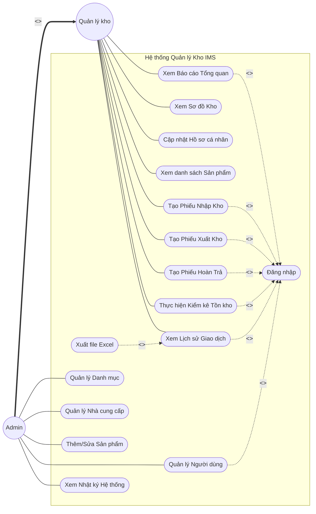
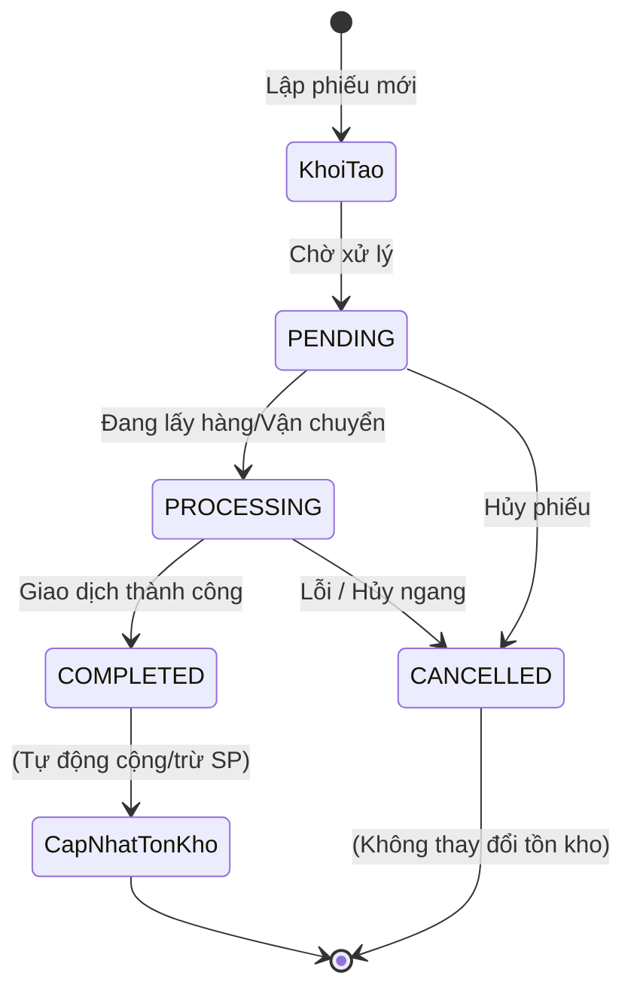
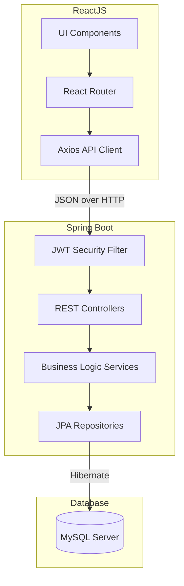
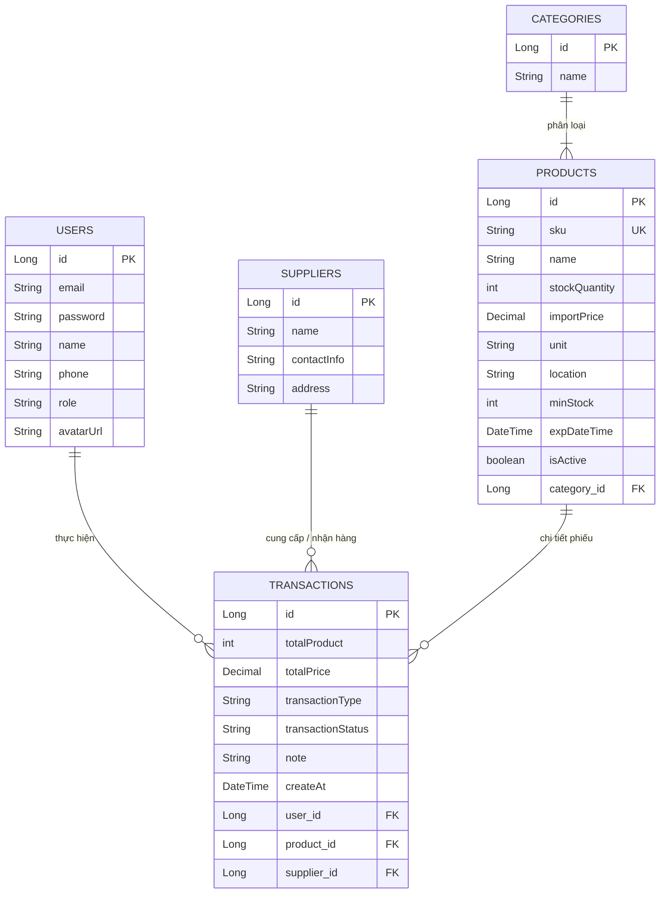
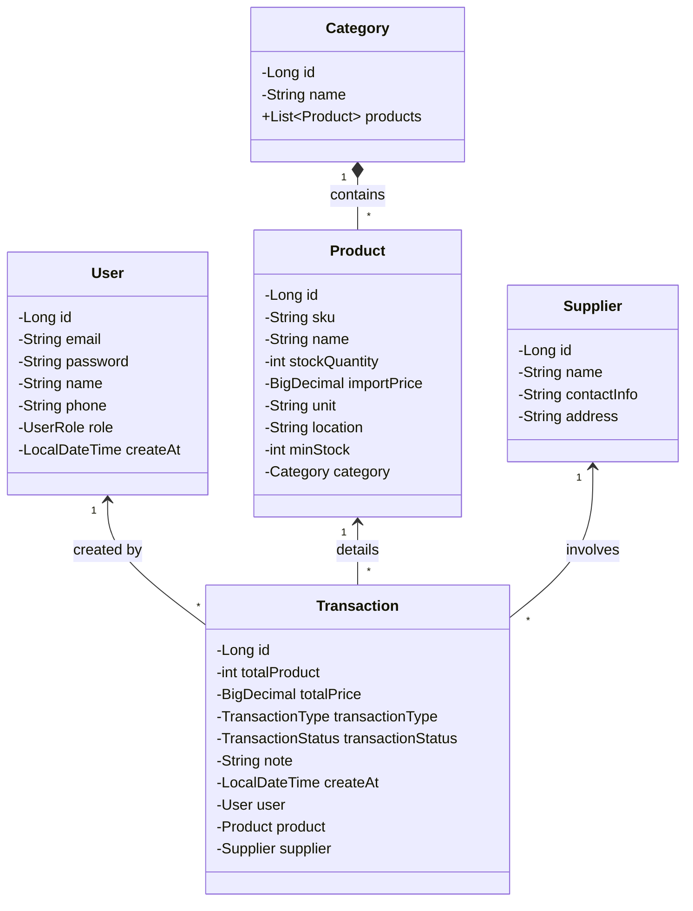
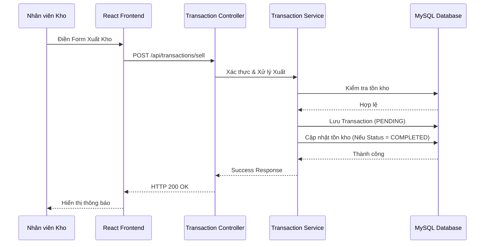

# Báo Cáo Phân Tích Và Thiết Kế Hệ Thống Quản Lý Kho (IMS)

Tài liệu này mô tả chi tiết quá trình phân tích, thiết kế và lên kế hoạch triển khai cho Hệ thống Quản lý Kho (Inventory Management System - IMS).

---

## 1. Define Project Vision

### Tầm nhìn dự án (Project Vision)
Xây dựng một hệ thống phần mềm quản lý kho nội bộ hiện đại, tập trung, giúp tự động hóa và số hóa các quy trình quản lý hàng hóa (nhập, xuất, hoàn trả, kiểm kê). Hệ thống giúp ngăn chặn sai sót dữ liệu, cung cấp cái nhìn tổng quan về tình trạng tồn kho theo thời gian thực và hỗ trợ trích xuất báo cáo nhanh chóng, chính xác.

### Nhận diện Người dùng và Các bên liên quan (Users and Stakeholders)
1. **Quản trị viên (Admin):** 
   - Có toàn quyền kiểm soát hệ thống.
   - Quản lý tài khoản và phân quyền cho nhân viên (MANAGER).
   - Theo dõi nhật ký hoạt động (Audit Logs) của toàn bộ hệ thống để đảm bảo tính minh bạch.
   - Toàn quyền xem và chỉnh sửa dữ liệu Hệ thống (Sản phẩm, Danh mục, Nhà cung cấp).
2. **Quản lý Kho (Manager):**
   - Thực hiện các nghiệp vụ kho hàng ngày: lập phiếu nhập kho, xuất kho, hoàn trả hàng cho nhà cung cấp và kiểm kê điều chỉnh.
   - Xem bảng báo cáo (Dashboard) tổng quan, sơ đồ kho và lịch sử chứng từ để đưa ra quyết định nhập/xuất hàng hóa phù hợp.

---

## 2. Use Case Modeling (Mô hình Use Case)

Dưới đây là các nhóm chức năng chính (Use Cases) của hệ thống:

---

## 3. Process Modeling (Mô hình Quy trình)

Quy trình nghiệp vụ lõi: **Xử lý Phiếu Giao Dịch (Nhập/Xuất/Hoàn Trả)**

---

## 4. Tổng quan kiến trúc

### Trích xuất các yếu tố kiến trúc
- **Tính sẵn sàng (Availability) & Khả năng mở rộng (Scalability):** Hệ thống được module hóa (tách biệt Frontend - Backend) giúp dễ dàng mở rộng.
- **Tính bảo mật (Security):** Phân quyền truy cập cứng (RBAC - Role Based Access Control) và xác thực không trạng thái (Stateless) bằng token.
- **Trải nghiệm người dùng (UX/UI):** Giao diện Single Page Application (SPA) mượt mà, phản hồi tức thời.

### Chọn Stack công nghệ
- **Frontend:** ReactJS (Vite), Axios, Recharts (Vẽ biểu đồ), CSS thuần/Module.
- **Backend:** Java 17, Spring Boot 3.x, Spring Data JPA, Spring Security (JWT).
- **Database:** MySQL 8.
- **Deployment:** Docker & Docker Compose.

### Xác định kiến trúc hệ thống
Hệ thống tuân theo kiến trúc **Client-Server** kết hợp **N-Tier (N-lớp)** ở phía Backend.
1. **Presentation Layer (Frontend):** Ứng dụng React chạy trên trình duyệt.
2. **Controller Layer (Backend API):** Chặn và điều hướng các HTTP Request.
3. **Service Layer (Backend Business):** Xử lý logic nghiệp vụ (cộng trừ tồn kho, tính toán thống kê).
4. **Data Access Layer (Backend Repository):** Giao tiếp trực tiếp với MySQL database.

---

## 5. Thiết kế kiến trúc chi tiết

### Sơ đồ thành phần (Component Diagram)

### Đặc tả API (API Specification)
Một số API cốt lõi:
- `POST /api/auth/login`: Xác thực và trả về JWT Token.
- `GET /api/transactions`: Lấy lịch sử giao dịch (hỗ trợ lọc theo Keyword).
- `POST /api/transactions/purchase`: Tạo phiếu nhập kho mới.
- `POST /api/transactions/sell`: Tạo phiếu xuất kho.
- `PUT /api/transactions/{id}`: Cập nhật trạng thái phiếu.
- `GET /api/dashboard/summary`: Lấy thông tin tổng quan Dashboard.

### Thiết kế cơ sở dữ liệu vật lý (ERD)

Cấu trúc cơ sở dữ liệu quan hệ gồm các bảng chính và mối liên kết:

### Thiết kế bảo mật
- **Authentication:** Sử dụng JSON Web Token (JWT). Token được cấp khi đăng nhập và đính kèm vào Header `Authorization: Bearer <token>` trong mọi request tiếp theo.
- **Authorization:** Chỉ user có Role `ADMIN` mới được gọi các API truy cập Logs, Quản lý người dùng và Tạo người dùng mới.
- **Data Protection:** Mật khẩu người dùng được băm (Hash) bằng thuật toán `BCrypt` trước khi lưu vào DB.

---

## 6. Thiết kế lớp & Hành vi

### Sơ đồ Lớp (Class Diagram)
Mô tả kiến trúc các Model trong Backend (Java/Spring Boot) và quan hệ liên kết (Associations) giữa chúng:

### Sơ đồ trình tự (Sequence Diagram) - Luồng Xuất Kho

### Mockup giao diện
Các màn hình chính đã được thiết kế:
1. **Layout chung:** Sidebar cố định bên trái (chia 4 nhóm chức năng), nội dung chính hiển thị bên phải.
2. **Bảng báo cáo (Dashboard):** Hiển thị 4 thẻ thông tin tổng quan, danh sách cảnh báo hàng sắp hết và biểu đồ đường Nhập/Xuất.
3. **Quản lý danh sách (Grid):** Thanh tìm kiếm và bộ lọc thời gian đặt trên Table, các nút tính năng Thêm/Sửa/Xuất Excel sắp xếp trực quan.

---

## 7. Lập kế hoạch triển khai

### Chiến lược kiểm thử (Testing Strategy)
- **Unit Testing (Kiểm thử mức đơn vị):** Kiểm thử các tính toán nghiệp vụ lõi ở Backend (cộng trừ tồn kho, tính tổng tiền, bắt lỗi exception nếu tồn kho không đủ).
- **Integration Testing (Kiểm thử tích hợp):** Đảm bảo API Controller gọi đúng Service và ghi/đọc DB chính xác. Thử nghiệm kết nối React <-> Spring Boot.
- **Manual / User Acceptance Testing (UAT):** Kiểm thử thủ công kịch bản thực tế (luồng Nhập -> Xuất -> Trả hàng -> Đổi trạng thái -> Kiểm tra Dashboard).

### Kế hoạch triển khai (Deployment Plan)
Hệ thống sử dụng chiến lược đóng gói **Containerization**:
1. **Môi trường Server:** Yêu cầu máy chủ (Linux/Windows) có cài đặt Docker & Docker Compose.
2. **Tích hợp Services:** 
   - `inventory-db` (MySQL)
   - `inventory-backend` (Spring Boot JAR chạy trên JRE 17)
   - `inventory-frontend` (Bản build Vite chạy trên Nginx)
3. **Thao tác triển khai:**
   - Cấu hình file `.env` (chứa DB URL, credentials, JWT Secret).
   - Chạy lệnh `docker-compose up -d --build`.
   - Mạng nội bộ Docker tự động liên kết các container và hiển thị Frontend ra ngoài.
4. **Bảo trì:** Logs ghi lại tự động. Update từng module bằng cách rebuild độc lập để không làm gián đoạn hệ thống.
